# The WTC Reviewer Tool
___
This is a tool created for WTC (*[WeThinkCode](https://wethinkcode.co.za/)*) lms system where students are required to review their peers work after submitting and grading their projects/submissions. They are required to review **3 Projects** from all three cohort (JHB, DURBAN, CPT), leave a comment on each project and submit their reviewed project. 

## This is the steps that you would usually take for the review section
___

1. Open Commandline/ Terminal
2. If not logged in log into lms.
3. Prompt the terminal for the lms reviews.
4. Choose the uuid of the project you want to review.
5. Start your reviews.
6. Clone the reviewee's project into your local drive.
7. Review their Code.
8. If you want to communicate to the reviewee, you must get their emails from the lms system by using the uuid.
9. After reviewing leave a comment! **[OPTIONAL]**
10. Submit your review.

As you can expect this is a tedious and time-consuming process and you have to do it three times. This projects aims to cut down on this problem by automating the process.

## This is a step-by-step process of how the project works
___

1. 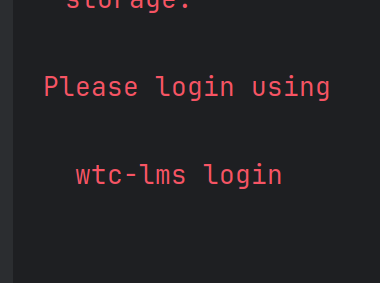  
First login into lms before starting program.
2. 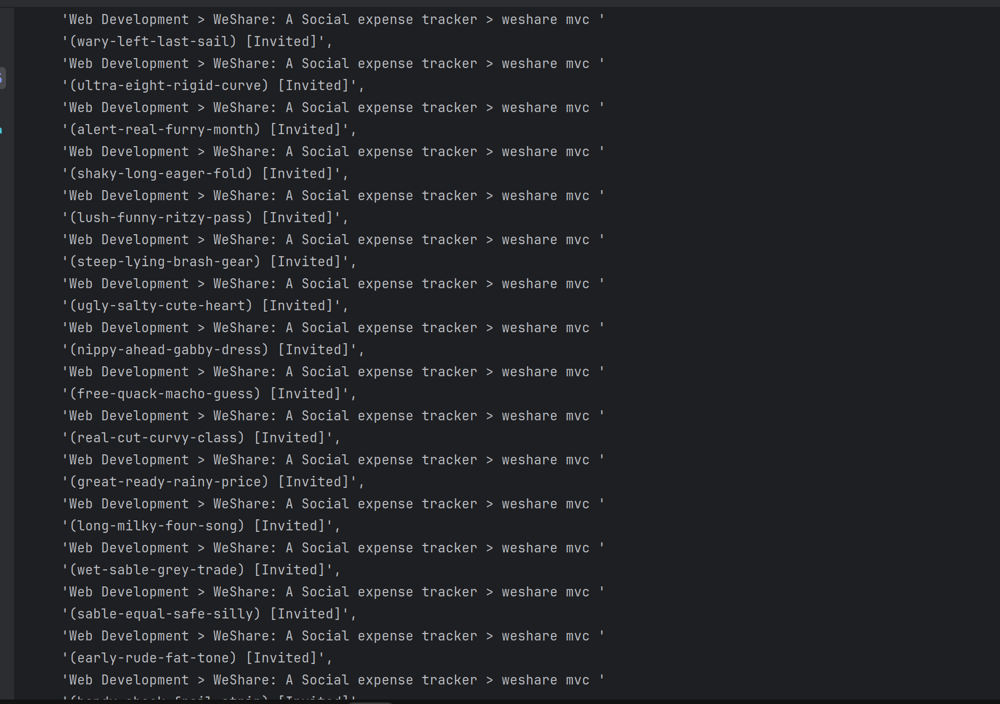  
   Once the program runs it will collect and display all the reviews that need to be reviewed [Invited].
3. 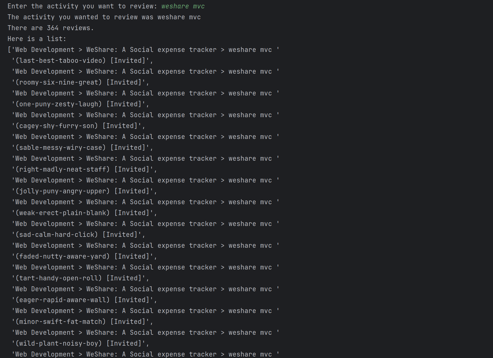  
   You'll be prompted which project name you want to review.
4. 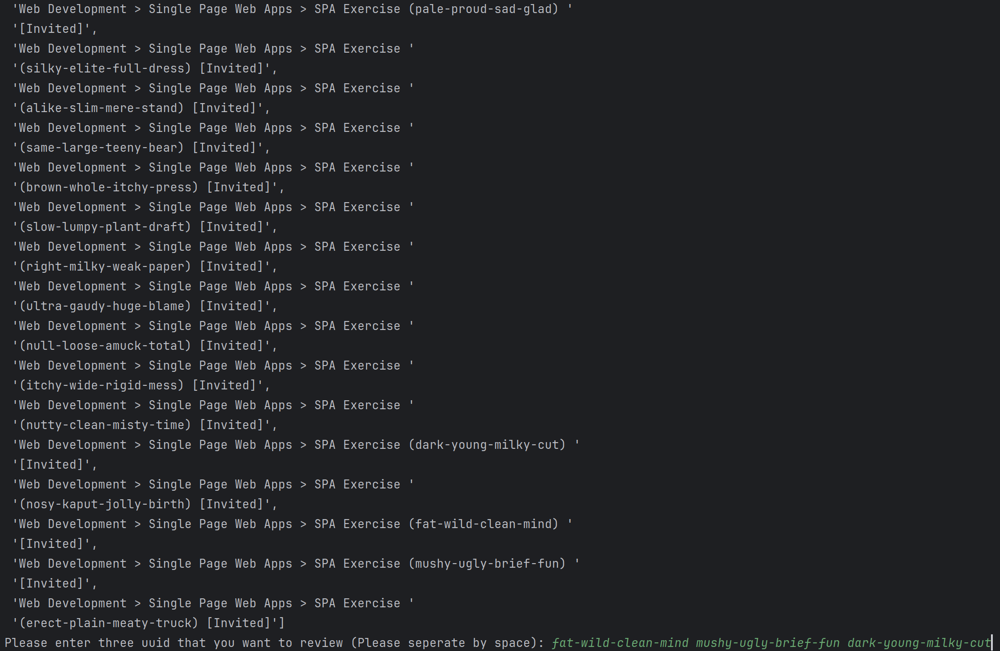  
   If you left the first prompt empty then you'll get prompted to give three uuid of the projects you want to review and what you want to call the review project for directory naming purpose.
5. 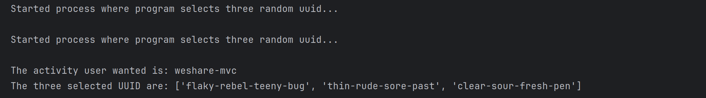  
   The program will grab three random uuid for you to review.
6. 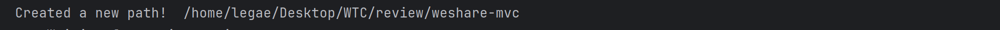  
   The program will then create a directory at your desktop called 'WTC/review/'.
7. 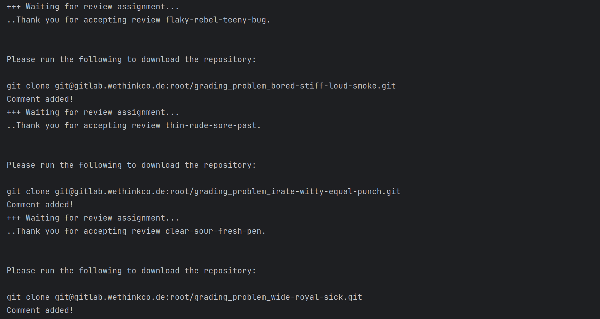  
   This part is where the program access the lms and runs the commands for the reviews.
8. 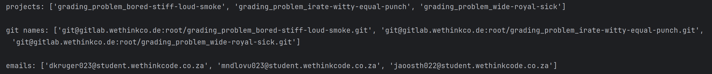  
   The program stores the projects name, git repository of the projects and the emails of each review.
9. 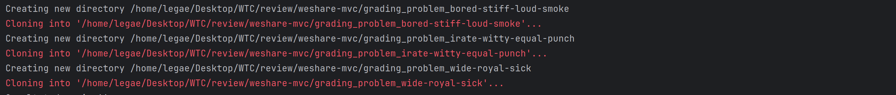  
   The program then clones the projects into the '/Desktop/WTC/review/{review_name}/' directory.
10. 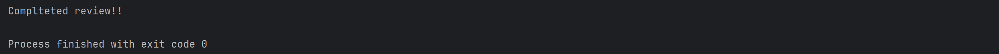  
    The program runs it final execution which is writing to a textfile then outputs completed review! with exit code 0. Which means success.
11. 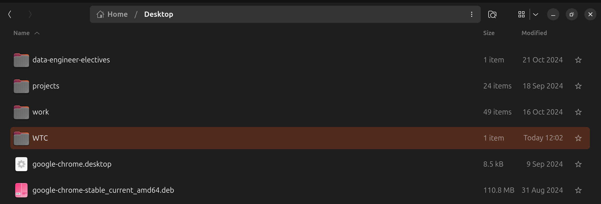   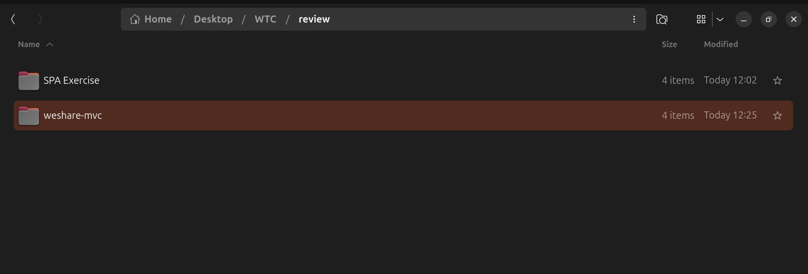   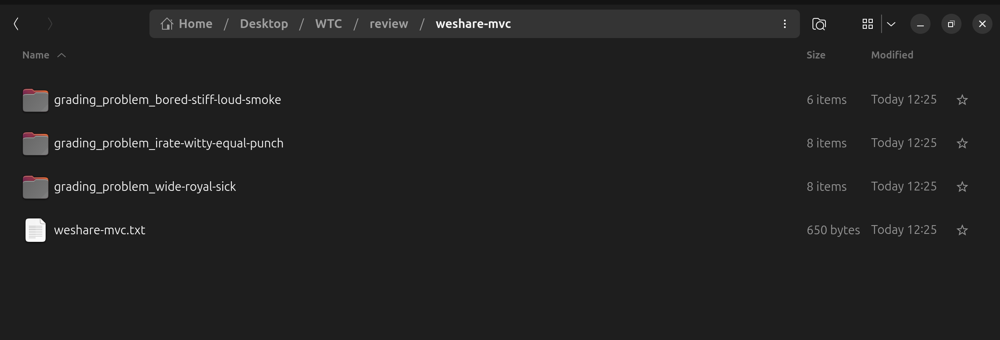  
    You can navigate to your desktop and see the directory.
12. 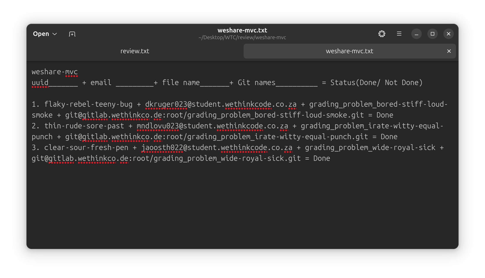  
    You can open the text file and use the information to email or slack the person you reviewed.
13. Automated review slack messages coming soon!!

___
Creator: ***[Legae/Lego](https://github.com/lmadisha)*** 
 
Corporation: ***[WeThinkCode](https://wethinkcode.co.za)***
 
Any improvements is welcomed, first fork the repo then add all functions and detailed explanation of what it does.
___